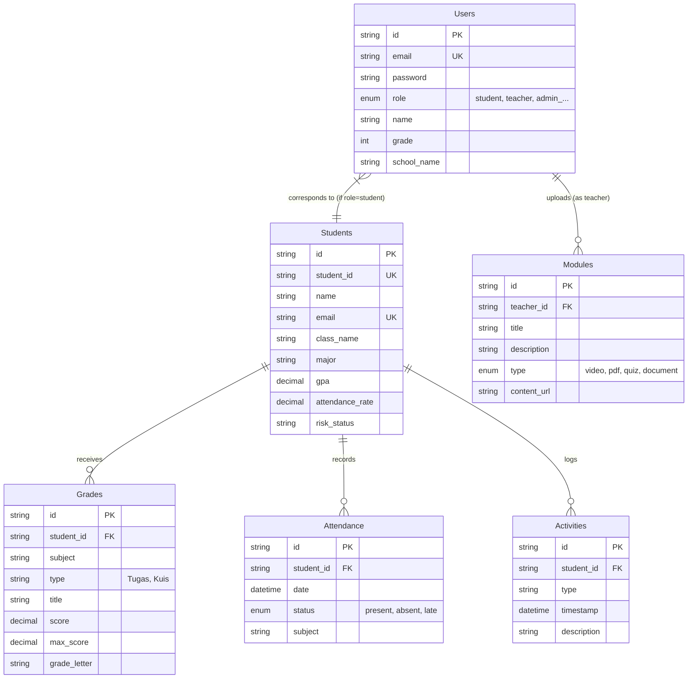
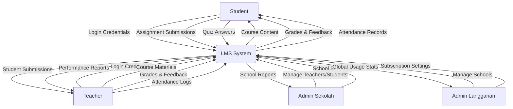
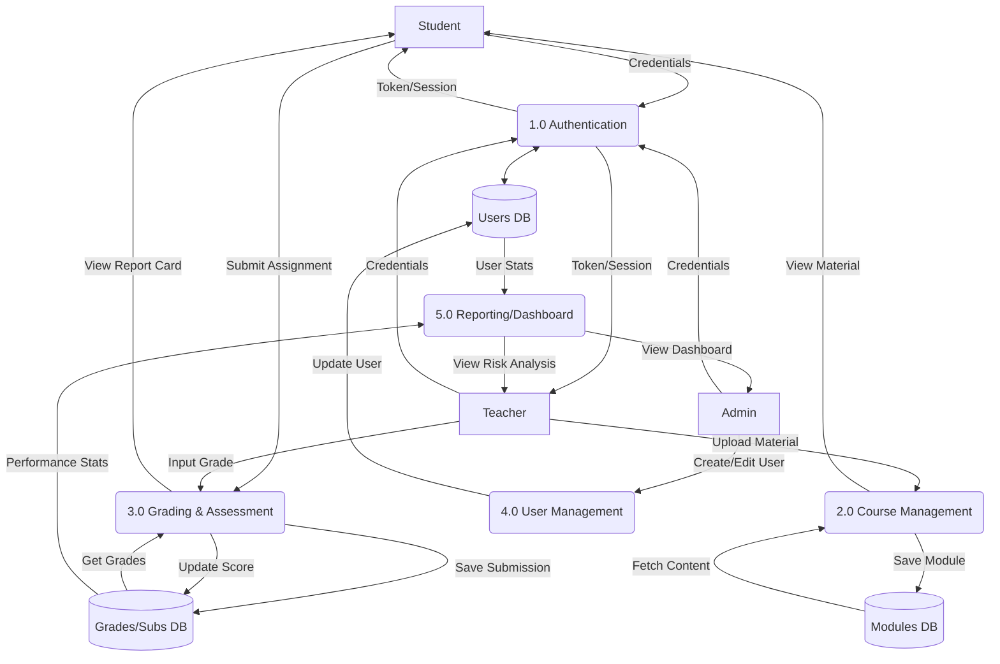
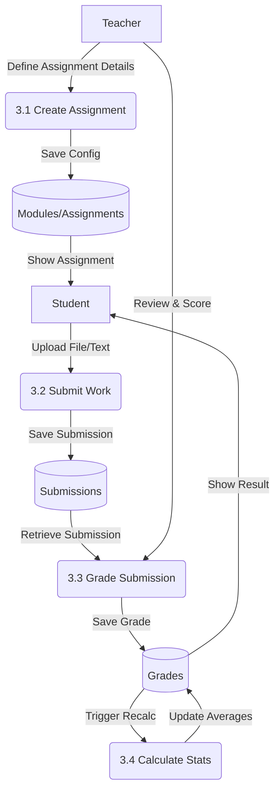
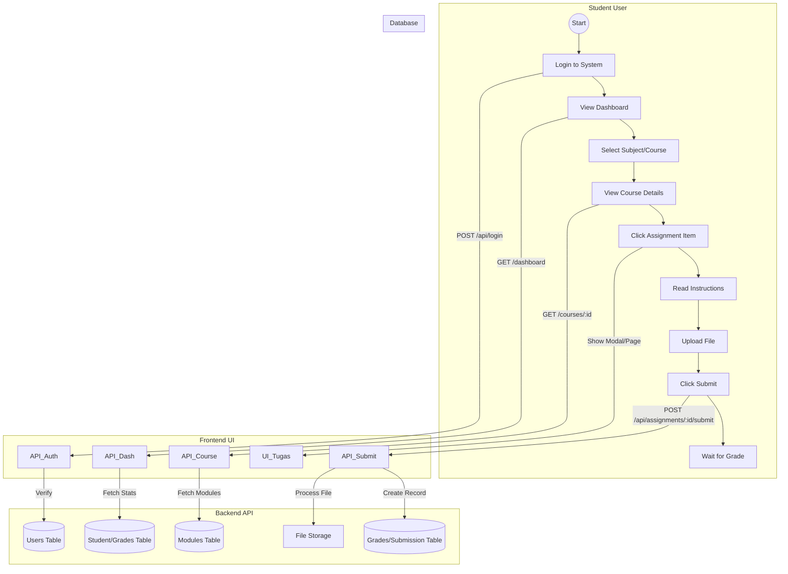

# System Design Documentation

## 1. Entity Relationship Diagram (ERD)

Based on the `db_lms.sql` schema and `dummy-data.ts`.

## 2. DFD Level 0 (Context Diagram)

High-level overview of the interaction between external entities and the LMS System.

## 3. DFD Level 1 (System Decomposition)

Breakdown of the main functional modules.

## 4. DFD Level 2 (Detailed Process: Assignment Submission & Grading)

Focusing on Process 3.0 (Grading & Assessment).

## 5. Flowmap / User Journey (Student Assignment Submission)

Sequence of interactions for a student submitting an assignment.

